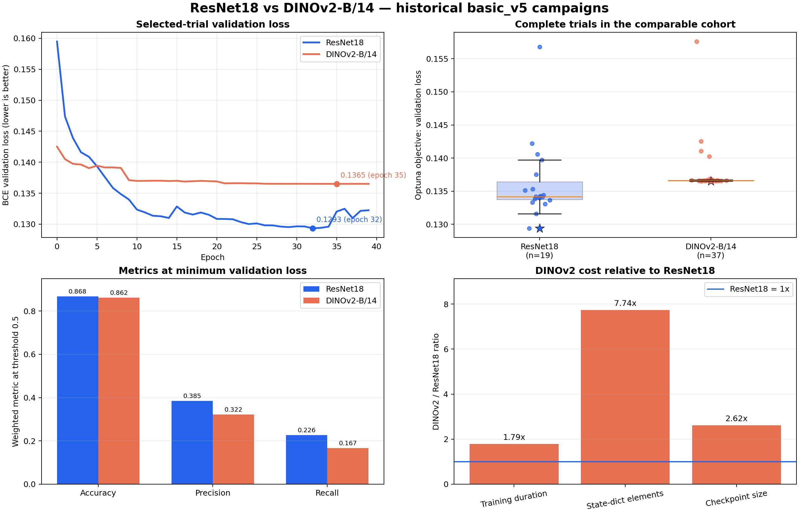

# Exploratory basic_v5 comparison: ResNet18 and DINOv2-B/14

**Created:** 2026-09-23
**Last updated:** 2026-09-23
**Status:** Reviewed historical validation evidence; not a final benchmark result

## Purpose and scope

This document records the reviewed comparison of the existing `basic_v5` ResNet and DINOv2 hyperparameter-tuning campaigns. It answers a bounded operational question: which artifact performed better under these two historical experiment protocols?

The answer is **ResNet18 trial 77**. It has lower validation loss, stronger aggregate threshold metrics, broader support across completed HPO trials, shorter training duration, and a smaller saved state than DINOv2 trial 61.

This result does not answer the final project question about intrinsic model-family superiority. The ResNet run fine-tunes its complete pretrained backbone, while the DINOv2 run is a frozen-backbone linear probe. The campaigns also predate the final paired mAP/micro-F1 methodology and do not use the test set.



## Evidence and provenance

The comparison was produced with the maintained local comparator in [`../../scripts/analise_exp/compare_experiments/`](../../scripts/analise_exp/compare_experiments/) and its documented contract in [`../implementation_details/experiment_comparison.md`](../implementation_details/experiment_comparison.md). The source campaigns are:

- `experiments/basic_v5/resnets_htuning/`;
- `experiments/basic_v5/dinov2_htuning_v1/`;
- `experiments/journal.log` for the Optuna study records;
- `experiments/wandb/` for the selected local W&B parameter histories.

The reviewed report was generated on 2026-09-14 with this command:

```bash
python -m scripts.analise_exp.compare_experiments \
  --experiments experiments/basic_v5/resnets_htuning experiments/basic_v5/dinov2_htuning_v1 \
  --wandb-root experiments/wandb \
  --optuna-journal experiments/journal.log \
  --metric val_loss \
  --direction min \
  --wandb-scope best \
  --checkpoint-metadata \
  --output analysis_outputs/basic_v5_comparison
```

The generated `comparison.json` contains all 200 numbered trial directories and has SHA-256 `9d6a9df9a9af122e2d0dc8b24219ce2bd6a4fa71200bfd18da5f38132e13902c`. It remains under the ignored `analysis_outputs/` directory because it is approximately 85 MB and embeds selected parameter trajectories. The comparison can be regenerated from the retained experiments and maintained command.

The quantitative review used the Optuna objective for campaign-level ranking, the reconciled CSV/TensorBoard curves for convergence, the companion CSV metrics at each selected trial's minimum observed validation loss, checkpoint metadata for state size, and W&B parameter histograms for distributional drift. No source artifact was modified.

## Comparable cohort

The primary comparison uses only the cohort shared by both campaigns:

| Field | Shared value |
| --- | --- |
| Metadata generation | `ingredients_target_v5_metadata.json` |
| Target field | `ingredients_target` |
| Configured outputs | 165 |
| Loss | `BCEWithLogitsLoss` |
| Loss weighting | Disabled |
| Epoch budget | 40 |
| Selection split | Validation |
| Historical metric contract | Batch-derived aggregate scalars |

This leaves 19 complete ResNet trials and 37 complete DINOv2 trials. Three complete ResNet trials with weighted BCE are excluded because their objective scale is not comparable. Both campaigns started 100 trials; Optuna reports 22 complete and 78 pruned ResNet trials, and 37 complete and 63 pruned DINOv2 trials.

The old configurations record the same metadata and 165-output task but do not preserve a label-order hash in the comparison signature. This is an explicit historical provenance limitation rather than evidence of a mismatch.

## Primary result

| Measure | ResNet18 | DINOv2-B/14 | ResNet advantage |
| --- | ---: | ---: | ---: |
| Best Optuna objective | **0.129406** | 0.136512 | 0.007106 lower; 5.21% |
| Median comparable objective | **0.134194** | 0.136611 | 0.002417 lower; 1.77% |
| Mean comparable objective | **0.136172** | 0.137557 | 0.001385 lower; 1.01% |
| Mean of best five objectives | **0.132198** | 0.136539 | 0.004340 lower; 3.18% |

The advantage is not limited to the single selected trial:

- 14 of 19 complete ResNet trials have a lower objective than the best DINOv2 trial;
- none of the 37 complete DINOv2 trials has a lower objective than the ResNet median;
- across all 703 descriptive ResNet–DINOv2 trial pairs, ResNet has the lower objective in 75.7% of pairs.

The pairwise percentage is descriptive. Adaptive HPO trials are neither independent nor identically distributed, and the different pruning outcomes make an inferential p-value inappropriate.

## Selected artifacts and aggregate metrics

The Optuna-selected artifacts are ResNet trial 77 and DINOv2 trial 61. The ResNet Optuna objective is the selected-checkpoint value `0.129406`; its CSV contains a slightly lower observed point, `0.129346`, at epoch 32. DINOv2's selected objective and minimum observed point are both `0.136512`.

| Metric at each trial's minimum observed validation loss | ResNet18 trial 77 | DINOv2 trial 61 | Difference, ResNet minus DINOv2 |
| --- | ---: | ---: | ---: |
| Validation loss | **0.129346** | 0.136512 | -0.007166 |
| Weighted validation accuracy | **0.8682** | 0.8618 | +0.0064 |
| Validation Hamming loss | **0.1318** | 0.1382 | -0.0064 |
| Weighted validation precision | **0.3846** | 0.3224 | +0.0622 |
| Weighted validation recall | **0.2261** | 0.1670 | +0.0592 |

The historical precision and recall use the saved TorchMetrics weighted aggregation and the default 0.5 threshold. They are not macro metrics and cannot reveal performance on rare ingredients. Accuracy and Hamming loss largely express the same thresholded label-error signal in complementary form.

## Learning dynamics

DINOv2 is initially stronger: its early validation-loss mean is `0.139537`, compared with `0.141487` for ResNet. ResNet then continues to adapt while DINOv2 saturates:

- ResNet first beats DINOv2's final best value at epoch 7 with `val_loss=0.135850`;
- ResNet first goes below `0.130` at epoch 26;
- DINOv2 never reaches `0.135`;
- normalized validation-loss AUC is `0.133228` for ResNet and `0.137352` for DINOv2;
- early-to-late mean improvement is `0.010732` for ResNet and `0.003021` for DINOv2.

DINOv2's late plateau is extremely stable (`late_std=4.08e-06`). ResNet has more late variation (`late_std=0.001284`) and rises from its epoch-32 minimum to `0.132249` at epoch 39. Best-checkpoint retention therefore matters more for ResNet.

At the minimum-loss epochs, the train-to-validation loss gap is approximately `0.0162` for ResNet and `0.0067` for DINOv2. The larger ResNet gap is consistent with greater task adaptation and greater overfitting risk; the smaller DINOv2 gap is consistent with the strong capacity restriction imposed by its frozen backbone.

## Compute and artifact cost

| Measure | ResNet18 trial 77 | DINOv2 trial 61 | DINOv2 / ResNet |
| --- | ---: | ---: | ---: |
| Optuna duration | 62.6 min | 112.0 min | 1.79x |
| Elements in checkpoint state dict | 11.27 M | 87.22 M | 7.74x |
| Best-checkpoint file size | 135.3 MB | 354.0 MB | 2.62x |

Both selected trials use batch size 128 and 40 epochs on the same recorded host. The duration remains an end-to-end campaign observation rather than a pure architecture benchmark because transforms, optimizers, schedulers, and trainable parameter sets differ.

## Parameter dynamics

The parameter histories explain the different curve shapes and define the most important interpretation boundary.

ResNet trial 77 uses the ImageNet-pretrained `Resnet18` wrapper and trains the complete network. All 62 W&B parameter series show non-zero first-to-last distributional drift. The largest normalized changes concentrate in deeper `layer4` and BatchNorm parameters, while the classifier also moves.

DINOv2 trial 61 records `freeze_backbone=true`. All 176 recorded backbone parameter series have zero distributional drift; only `linear_head.weight` and `linear_head.bias` change. The head weight increases by 116.8% in histogram-estimated relative RMS and the bias by 15.3%. The head has 633,765 trainable parameters, about 0.73% of the 87.22 million state-dict elements.

These observations are consistent with a frozen-feature plateau: the linear head learns the separable signal available in fixed DINOv2 features, while ResNet can adapt every representation to the ingredient task. W&B parameter histograms support distribution-level change claims; they do not recover exact per-weight update vectors.

## Hyperparameter observations

Within the comparable unweighted ResNet cohort, the pretrained ResNet18 variant has median objective `0.134133`, versus `0.140148` for the ResNet-like variant. The three complete `aug_hard` trials have median `0.131576`, but the group is too small for a causal augmentation claim. Trial 77 uses Adam, learning rate `3.13e-5`, weight decay `2.91e-4`, hard augmentation, and cosine warm restarts.

For DINOv2, the 33 complete `ReduceLROnPlateau` trials have median objective `0.136608`, compared with `0.141797` for the four trials without a scheduler. The best DINOv2 results are tightly clustered, which suggests that tuning the linear head has reached a stable limit under the frozen-backbone protocol. These conditional HPO associations remain descriptive and confounded by Optuna's adaptive sampling.

## Interpretation and retained decision

For the historical artifacts as trained, **ResNet18 trial 77 is the preferred model**. It wins on validation loss, every available aggregate metric at the selected operating point, the upper part of the HPO result distribution, training duration, and saved-state size.

The supported scientific claim is narrower:

> Full fine-tuning of the pretrained ResNet18 outperformed a frozen-backbone DINOv2-B/14 linear probe in the historical `basic_v5` validation campaigns.

This result does not establish that ResNet18 is intrinsically better than DINOv2 under partial or full DINOv2 fine-tuning. It is retained as an exploratory engineering result and historical baseline. It does not change the adopted model portfolio, select the final benchmark winner, or release the Macro-section 7 resume gate.

## Limitations and next evidence

1. The test split was not evaluated; validation selected both hyperparameters and the reported winners.
2. There are no repeated fixed-configuration seeds, so no seed-level uncertainty claim is possible.
3. Per-ingredient logging was not enabled in these historical runs; macro, rare-label, cuisine, and observability-slice conclusions are unavailable.
4. The legacy artifacts do not serialize a verified label-order hash in the report signature.
5. The training protocols differ materially: full ResNet fine-tuning with hard augmentation versus a frozen DINOv2 backbone and no explicit custom augmentation.
6. The campaigns optimize validation loss rather than the final paired label-macro mAP and micro F1 policy.
7. A fair architecture-level DINOv2 follow-up would need a predeclared partial or full fine-tuning protocol, matched evaluation, and comparable augmentation and compute reporting.

The final project ranking still requires comparable Macro-section 6 runs, validation-only thresholding, fixed reporting tables, repeated-seed limitations stated explicitly, and one final test evaluation under the binding methodology.

## Related documentation

- [`README.md`](README.md) defines the experiment-results collection.
- [`../implementation_details/experiment_artifacts.md`](../implementation_details/experiment_artifacts.md) records artifact semantics and audit findings.
- [`../implementation_details/experiment_comparison.md`](../implementation_details/experiment_comparison.md) defines the maintained comparison command.
- [`../plans/experiment_comparison.md`](../plans/experiment_comparison.md) preserves the completed tooling plan.
- [`../project_objective/model_comparison_methodology.md`](../project_objective/model_comparison_methodology.md) owns the binding final-comparison design.
- [`../project_objective/benchmark_decisions.md`](../project_objective/benchmark_decisions.md) owns the frozen data and evaluation boundaries.
- [`../general_plan.md`](../general_plan.md) owns the status and resume gate for final result comparison.
