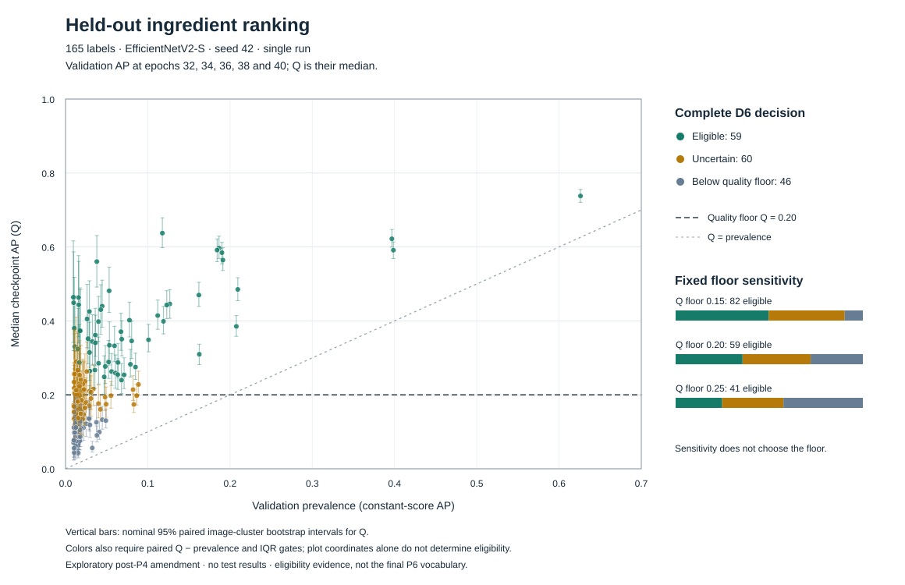

# Phase 3 v3 D6 held-out-quality profile

**Created:** 2026-10-05
**Last updated:** 2026-10-05
**Status:** Reviewed, frozen exploratory post-P4 inclusion evidence; P6 projection published separately below.

## Purpose and boundary

This record owns the numerical application of the user-approved
[Phase 3-D6 policy](../project_objective/model_comparison_methodology.md#phase-3-d6--held-out-quality-inclusion-policy)
to the same completed 40-epoch, seed-42 EfficientNetV2-S campaign. It follows
the [inclusion-policy audit](phase3_d1_v3_inclusion_policy_audit.md), which
motivated the change without requiring a larger vocabulary. The
[original D4/P4 result](phase3_d1_v3_full_profile.md) remains unchanged.

D6 selects sufficiently strong, sustained validation ranking of recipe
ingredients, including image-derived dish/context information. It does not
identify every label showing learning, prove direct visibility, or declare
excluded labels intrinsically unlearnable. All 165 outcomes were known before
the amendment; it is explicitly outcome-informed and exploratory, not a second
blind pilot. No new model training or inference was performed.

## Evidence and reproduction

From the repository root with the existing NumPy environment:

```bash
python scripts/ingredient_selection/review_inclusion.py \
  analysis_outputs/ingredient_selection/phase3-d1-v3
```

The [maintained implementation](../implementation_details/ingredient_selection.md#d6-saved-score-inclusion-review)
validates the campaign, original rule/evidence, class order, train/validation
metadata, training source ZIP and all 152 members. It matches IDs and targets
in every late-checkpoint score archive, reconstructs AP and verifies all five
values per class against saved metrics. Independent sklearn recomputation
had maximum absolute discrepancy `9.71e-17` (tolerance `1e-12`).

The new artifacts are isolated under
`analysis_outputs/ingredient_selection/phase3-d1-v3/inclusion_d6_v1/`:

| Artifact identity | SHA-256 |
| --- | --- |
| `inclusion_rule.json`, canonical artifact hash | `851c52cc485279895cf369368fe62076ad3be7318a80e9d3109a20b186dbbcdc` |
| `inclusion_report.json`, canonical artifact hash | `4f065e1bcdb2158d1c52e529970b4d47f2dd5165873e2bf03fbe599e5ca4861f` |
| Analysis `source_snapshot.zip`, file hash | `dbd08cb3e56e9d112c212038a9bb52d2a75c5267107210c61fb22a4aa3f980ff` |
| Ordered validation ID/image/SHA-256 triples, canonical hash | `fc7ff9087d98853b8bb2818afe82c4b4718145cd8ee6e9a909557366a55c22c1` |

The rule records Git base `591fe2a`, exact hashes of five analysis-source files,
Python `3.10.18`, NumPy `2.1.2`, every input digest and the image-group artifact.
Uncommitted source bytes are preserved in the ZIP; a later commit does not
change this analysis identity. Source, input and validation-image bytes are
rechecked before report publication. Full repeated execution must reproduce
all six artifacts byte-for-byte; changed outputs are rejected rather than
overwritten. Two complete executions on 2026-10-05 passed that check.

### Corrected uncertainty

The 5,996 validation records contain 5,847 exact-image SHA-256 groups. There
are 121 repeated groups covering 270 records: 102 pairs, 13 triples, four
groups of four, one of five and one of six. The remaining 5,726 groups are
singletons. Records sharing bytes remain together in each bootstrap draw;
their targets and record weights are not merged or deduplicated.

Each label has 1,000 valid cluster resamples (165,000 overall), with zero
invalid draws in this execution. Within each resample, AP is computed
separately at epochs 32/34/36/38/40, their median Q is formed, and validation
prevalence is recomputed on the same records. Separate nominal 95% intervals
describe Q and paired Q minus prevalence. This replaces the old mismatch
between a late-window median and an epoch-40-only interval.

## Reviewed outcomes

| D6 outcome | Labels | Meaning in this campaign |
| --- | ---: | --- |
| `included` | 59 | Eligible for the shared projection under every D6 requirement. |
| `uncertain` | 60 | The quality interval crosses the declared 0.20 boundary; not promoted. |
| `below_quality_floor` | 46 | The quality interval is wholly below 0.20; this is not an absence-of-learning claim. |

All labels pass the paired positive-advantage screen, with minimum lower bound
`0.01421`, and all pass the validation-IQR screen, with maximum `0.01777`.
Consequently, the absolute quality requirement determines membership here.
Of the 60 uncertain labels, 26 have point Q at least 0.20 and 34 have point Q
below it. There are no manual membership exceptions.

All **25 original D4 candidates are retained**, with **34 additions**: all 13
original `context_predictable` labels and 21 originally `uncertain` labels.
The full original-to-revised transition and all ordered names/indices are
retained in [the machine-readable report](../../analysis_outputs/ingredient_selection/phase3-d1-v3/inclusion_d6_v1/inclusion_report.json),
alongside train acquisition, gap, cuisine, support and nearby-window diagnostics.

Among the 59 eligible labels, train support ranges from 454 to 30,023,
validation support from 57 to 3,754, and Q from `0.23979` to `0.73799`.
Banana and strawberry are the two eligible labels below the old final-train
support cutoff; their Q intervals are approximately `[0.3415, 0.6165]` and
`[0.3196, 0.5866]`. Their promotion follows the same numerical rule as every
other label, not a special low-support exception.

The earlier audit's **60** was only a counterfactual using old uncertainty.
With corrected intervals, `zucchini food product` is uncertain: Q `0.26311`,
interval `[0.18813, 0.34248]`. It is the only membership difference from that
counterfactual. Neither the floor nor the resampling rule was adjusted to
recover it.

### Fixed threshold sensitivity

| Quality floor | Eligible | Uncertain | Below quality floor |
| --- | ---: | ---: | ---: |
| 0.15 | 82 | 67 | 16 |
| **0.20 (adopted)** | **59** | **60** | **46** |
| 0.25 | 41 | 54 | 70 |

This fixed panel demonstrates sensitivity to the operational quality
definition; it does not choose a threshold by vocabulary size. AP 0.20 remains
a project convention, not a literature-standard learnability boundary or
20% classification accuracy. For example, yogurt's lower bound is `0.20166`
and green beans' is `0.19821`: the saved strict decisions are reproducible,
but their proximity to the boundary deserves caution rather than a claim of
intrinsically different learnability.



## Verification and limitations

- All 26 new synthetic statistics, integration and rendering tests pass.
  They cover tied AP, explicit clustered record replication, deterministic
  resampling, exact decision boundaries, independent reasons, write-once
  reruns, source/input tamper rejection and test-path isolation.
- All 100 repository tests pass. **Scope distinction:** the pre-existing
  `test_v5_vocabulary_is_shared_and_contains_no_unknown_target` reads actual
  train/validation/test metadata solely to verify encoder compatibility.
  It produces no test predictions or predictive metrics. D6's selection
  command and independent numerical checks never open the test split;
  that generic schema check did not inform the policy or membership.
- Independent review reproduced every primary/sensitivity decision from the
  frozen scalar evidence and verified source ZIP/hash provenance.
- The original D4 rule, classifier source, P4 evidence/report and the two
  pre-existing user-owned training/IDE edits retain their original hashes.
- Image and per-audit score hashes were not stored at campaign launch. D6
  hashes retained bytes now, verifies metadata and score/metric parity, and
  recovers groups from the current images. It does not prove retroactive
  launch-time byte identity.
- These are nominal per-label, finite-validation-sample intervals conditional
  on one selector, split, seed and configuration. They are not simultaneous
  guarantees, training-seed uncertainty or unbiased post-selection performance.
  Near/late windows overlap four checkpoints and are not independent replicas.

## D6 review handoff

At completion of the D6 review, the reopened P4 policy and numerical review
were complete, with P6 still responsible for the
named, versioned projection and downstream contract: export the eligible
names/original indices with rule/evidence hashes and explicit excluded/uncertain
reasons, without changing the full 165-label default. P7 integration/cleanup,
Macro-section 6 selected/random training and the final benchmark remain
separate. That review did not itself publish the final projection.

## P6 publication — 2026-10-05

After the D6 implementation and evidence were committed as `a1d17bc`, the
separately authorized P6 exported
[`ingredients_selected_v5_d6_v1.json`](../../src/ingredient_selection/resources/ingredients_selected_v5_d6_v1.json).
It contains exactly the **59** D6-eligible names in original class order, their
original indices, and the **60 uncertain / 46 below-floor** excluded groups
with independent reasons and axes. No membership changed from the report.

| Published identity | SHA-256 |
| --- | --- |
| Projection, canonical artifact hash | `c8e9c88fc240dd3a27cfe527289e691ecdd579595776b71c5837c67a003e9767` |
| Ordered selected class names, canonical hash | `b2b5943cac5fb1f967feb4946304c1b0bdaae78a84252d90a727245359b5ff41` |

The resource also binds the exact D6 rule/report hashes above, campaign identity,
original metadata/class-order hashes and exporter source inventory. Reproduction:

```bash
python scripts/ingredient_selection/export_projection.py \
  analysis_outputs/ingredient_selection/phase3-d1-v3
```

Repeated exports agree byte-for-byte. Thirteen focused packaging tests and 113
repository tests pass. The exporter reads only the retained manifest, D6
rule/report/source ZIP and its own source files, not metadata, images or scores.
It validates approved identities and refuses changed existing output. The
generic suite's metadata-only test-split compatibility caveat above remains
applicable; no new predictive test evaluation or model training was performed.

This is the **frozen shared vocabulary definition**, not a second metadata
generation, a change of runtime defaults or an unbiased final performance
result. All D6 interpretation limits remain. The
[methodological handoff](../project_objective/model_comparison_methodology.md#p6-shared-projection-freeze--2026-10-05)
requires identical original record populations, including recipes with empty
projected targets. P7 owns runtime integration and retention-gated cleanup;
Phase 6 owns later selected/random vocabulary training. No such work was
performed during publication.
